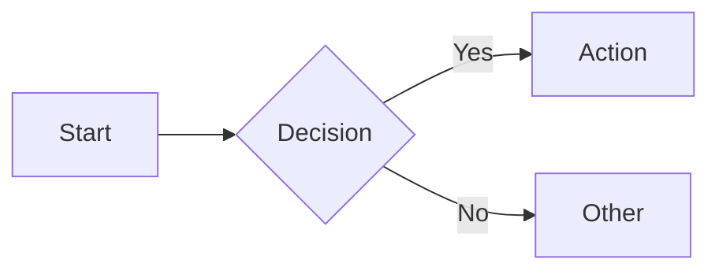

# Mermaid Reference

*Mermaid diagram types natively supported in Obsidian for visual documentation.*

---

## Available types

| Type | Usage |
|------|-------|
| `flowchart` / `graph` | Process flows, decision trees |
| `sequenceDiagram` | Interactions between actors |
| `classDiagram` | Structure, relationships |
| `stateDiagram-v2` | State machines, transitions |
| `erDiagram` | Entity relationships |
| `gantt` | Timelines, planning |
| `pie` | Proportions |
| `mindmap` | Concept maps |
| `timeline` | Chronological events (requires recent Obsidian) |
| `gitGraph` | Git history visualisation |

## Usage

Wrap in a fenced code block with `mermaid` language identifier:

````

````

## Limitations

Some Mermaid types (`zenuml`, `packet-beta`, `sankey-beta`, `xychart-beta`) are not natively supported in Obsidian. Availability depends on the Mermaid.js version bundled with the installed Obsidian version.

A diagram is documentation, not illustration. Use it when structure can be shown. A diagram for three boxes linked by two arrows is waste — text suffices.
