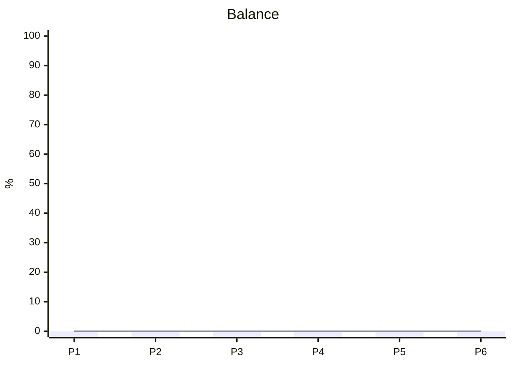

# CALIBRATION

*The why behind the numbers.*

> [!info] Source of truth for the balance.
> When context changes, document here first, then recalculate BALANCE.md.

---

## Theoretical balance

> [!tip] The baseline distribution desired between partitions, context-free.

| # | Partition | Theoretical |
|---|-----------|-------------|
| 1 | | % |
| 2 | | % |
| 3 | | % |
| 4 | | % |
| 5 | | % |
| 6 | | % |

## Situation fragments

> [!tip] Each fragment is dated and explains the why of a deviation from the theoretical balance.

### {date} — {title}

{Description of the situation, the tension, the opportunity or the constraint.}

**Impact:** {which partition is affected and in which direction.}

## X-Ray

> [!tip] Visualisation of the gap between theoretical and effective.
> Bars = effective, Line = theoretical. Bar above = overweighted, below = underweighted.

> [!question]- Migration to radar-beta
> When Obsidian supports Mermaid >= 11.6.0, replace with radar-beta for a spider chart.
