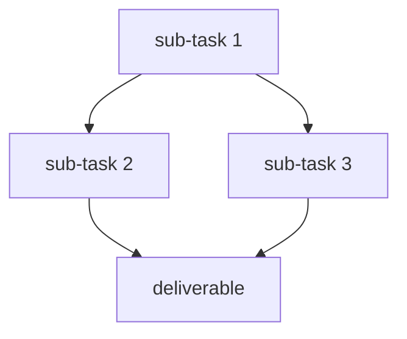

> [!info] Optional structure.
> The filename is enough for simple tasks. This content is useful for worksites and rhythms that need context.

---

{notes, context}

## Sub-tasks

> [!tip] For worksites only.
> The guardian presents relevant sub-tasks in the allocation.

### Linear

> [!info] Queue of similar elements. Counted.

- [ ] sub-task 1
- [ ] sub-task 2
- [ ] sub-task 3

### Graph

> [!info] Different steps with dependencies. Milestoned.

