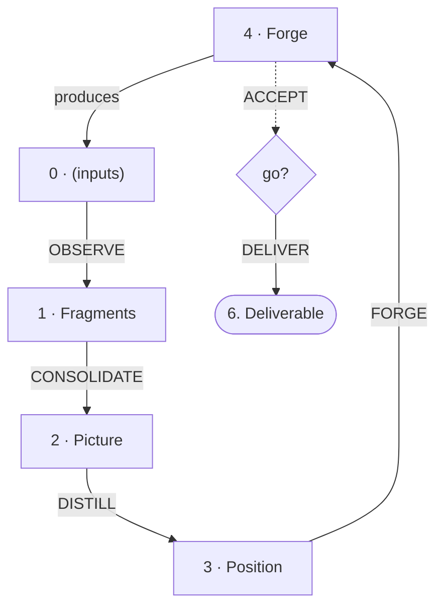

# Elasis

*The swift forge.*

A method for projects where the result is critical and the knowledge is well understood. From fragments to deliverable — one cycle, no ceremony.

Elasis is the simplest profile of the Kyklos family. Same cycle as Organon and Anabasis, without the optional refinement modules.

The name means "driving forward" (ἔλασις).

---

## The Cycle

Every Kyklos method is a cycle. Forge acts on the world and produces results. Results feed fragments. Fragments consolidate into knowledge. Knowledge frames action. Action forges.



| # | Level | Pole | Role |
|---|-------|------|------|
| 0 | *(parallel input folders)* | Experience | Raw input — lived, received, observed |
| 1 | Fragments | — | Observe, name, keep |
| 2 | Picture | Knowledge | Consolidate into patterns |
| 3 | Position | — | Frame for action (+ directives) |
| 4 | Forge | Experience | Materialise, act on the world |

Two poles: **Forge/inputs** (experience) and **Picture** (knowledge).
Two interfaces: **Fragments** (between experience and knowledge) and **Position** (between knowledge and action).
Two artifacts: **Knowledge Artifact** (output of Picture) and **Executable Artifact** (output of Forge).

The cycle: `4 → 0 → 1 → 2 → 3 → 4`

---

## Project Structure

```
Project/
├── README.md
├── INTENTION.md
├── REQUESTS.md
├── 1. Workshop/
│   ├── 0. References/
│   ├── 1. Fragments/
│   ├── 2. Picture/
│   ├── 3. Position/
│   └── 4. Forge/
├── 6. Deliverable/
├── 7. Attic/
├── 8. Purgatory/
├── 9. The Void/
├── local/
└── µ. LOCAL/
```

Level 0 can have multiple parallel folders (`0. References/`, `0. Result/`, `0. Communication/`, etc.) — create what you need. See CHOICES (Kyklos .. CHOICES) for the full catalogue.

Gestures are documented in `µ. LOCAL/` — see Praxis (Tekton .. Praxis .. PRAXIS) for the infrastructure conventions.

---

## The Levels

### Input Zone (0)

Raw material of different types, held in parallel folders all numbered 0. Results from previous forge cycles, external references, communications, dialogues, surveys — each in its own folder. Not every project needs all of them.

Level 0 is not a working phase. It is an inbox — what enters the cycle before any observation has been made.

### Fragments (1)

Observations named and kept. Specific, grounded, tied to context. A fragment says: "I noticed this, it matters, here's why."

Fragments can emerge from any input folder or from unrecorded experience. The gesture is the same: OBSERVE — name, keep.

A good fragment is a module with minimal coupling — an autonomous unit of reasoning. Graph-theoretic analogy: fragments are nodes, dependencies are edges. Good fragmentation minimises inter-fragment edges.

### Picture (2)

Patterns consolidated from fragments. The Picture is honest synthesis — what recurs, what conflicts, what connects. It is the knowledge pole of the cycle.

The Picture does not choose. It maps. Choices belong to Position.

The Picture is a **Knowledge Artifact** — it can be shared, referenced, and used independently of the rest of the cycle.

### Position (3)

Where choices are made. Given the patterns mapped by the Picture, Position picks a stance — what we do, what we reject, what we accept as trade-off.

Position carries **context** — lateral forces that shape decisions without participating in them: choices, constraints, beliefs. These are implemented as directives (Genesis convention).

Position is the interface between knowledge and action. It translates understanding into intent.

### Forge (4)

Where intent becomes artefact. The Forge materialises — it acts on the world, produces the deliverable, generates results.

The Forge includes **UAT** — review against the previous deliverable before delivery. What is forged is tested before it replaces what exists.

The output is an **Executable Artifact** — something that works, that can be deployed, used, applied.

The Forge is the experience pole of the cycle. What is forged produces results (fed back to 0), which feed the next iteration.

---

## Gestures

Elasis defines seven gestures. Each follows the Praxis anatomy (Tekton .. Praxis .. PRAXIS). The gesture files live in `µ. LOCAL/GESTURES/`. The PLAYBOOK describes their sequencing.

| Gesture | Transition | Nature |
|---------|-----------|--------|
| OBSERVE | 0 → Fragments | Name an experience worth keeping |
| CONSOLIDATE | Fragments → Picture | Reveal the patterns |
| DISTILL | Picture → Position | Frame for action |
| FORGE | Position → Forge | Materialise |
| ACCEPT | Forge → go/no-go | Review against the previous deliverable |
| DELIVER | Forge → Deliverable | Install the new, keep the previous recoverable |
| HARVEST | (external) → Fragments | Import from another project |

The first four form the cycle. ACCEPT and DELIVER are a gate between the Forge and the Deliverable — ACCEPT is a judgment (tekhnē), DELIVER is a transport (automaton). HARVEST is transversal — it feeds the cycle from outside.

FORGE begins by prospecting what already exists — components, patterns, or solutions that can be assembled — so that only the delta needs to be created.

---

## Directives

At each level, **directives** can influence the work without participating in it. They are lateral forces — scope boundaries, constraints, preferences — that shape judgment without being the judgment.

Directives are UPPERCASE files inside the level's folder. They are typed on two axes — source and binding force:

| Directive | Source | Force | What it says |
|-----------|--------|-------|--------------|
| FRAME | — | Structural | "Here is the perimeter" |
| CONSTRAINTS | External | **Strong** | "You must respect this — imposed from outside" |
| CHOICES | Internal | **Strong** | "We decided this — it must be respected" |
| CONSIDERATIONS | External | **Medium** | "Here is the terrain — take it into account" |
| CONVICTIONS | Internal | **Medium** | "We believe this deeply — it influences but does not prescribe" |
| TEMPERED | Experience | **Strong** | "Practice has confirmed this" |

The strong pair — CONSTRAINTS and CHOICES — must be respected. The medium pair — CONSIDERATIONS and CONVICTIONS — influence without prescribing. TEMPERED has survived practice and is the strongest form.

Directives survive regeneration. If the work at a level is rewritten, directives remain — they are the memory of what was learned along the way.

---

## Bridges

New knowledge can challenge existing directives. When a fragment, a pattern, or any new insight contradicts a directive at any level, the directive must be revisited.

This is not a separate mechanism — it is the natural consequence of the cycle. Every pass through OBSERVE → CONSOLIDATE → DISTILL is an opportunity to confront what was previously decided. If a Position directive no longer holds given the current Picture, revise it.

The cycle self-corrects by walking.

---

## Injection

The cycle is not a monologue. At each level, reviewing the output reveals things you didn't know you knew:

- Something jars → a fragment is missing, or a constraint was undocumented
- Something resonates → a deeper principle is at work, worth capturing

Capture it in directives (at the current level) or in fragments (upstream). Then regenerate. By iteration, the output converges toward what is right.

The process is not: specify then generate. It is: generate, review, inject, regenerate.

---

## Input Channels

A project needs visible entry points for feedback. **REQUESTS.md** receives suggestions, critiques, and demands from any operator at any level. It feeds the project without contaminating work in progress.

A request is a living item. Open items need attention. Resolved items are either elevated (into a fragment, a deliverable, a README, a CHANGELOG) or deleted. The request is not the memory — the artefact it produced is.

---

## Excluded Zones

Three zones with a retention gradient:

| # | Zone | Purpose | Contract |
|---|------|---------|----------|
| 7 | **Attic** | Archived/historical | Preserved for reference, not for active work |
| 8 | **Purgatory** | Superseded content | Consultable for rollback, cleanable periodically |
| 9 | **Void** | Discarded content | May be wiped without notification |

The contract applies to any operator — human or AI. No one should read, search, cite, or rely on content in excluded zones, but anyone can use them as destinations when moving content out of active areas.

---

## How to Use

### Starting a Project

1. Create the folder structure (or deploy the template)
2. Write **INTENTION.md** at the root — why does this project exist?
3. Start with **Fragments/** — what do you observe? What matters?
4. Move to **Picture/** when fragments reveal patterns worth consolidating
5. Move to **Position/** when you need to frame for action
6. Move to **Forge/** when you need to produce

### Maintaining a Project

- When reality changes, update from the bottom: Fragments first, then let changes propagate through the cycle.
- When Position drifts from Picture, reconcile — don't let them diverge silently.
- Date your fragments. Your future self will thank you.
- Use directives to capture what you learn along the way — they are your lateral memory.

### Producing the Deliverable

FORGE generates the artefact in `4. Forge/`. ACCEPT compares it with the current version in `6. Deliverable/` — what changed, what was lost, what was gained. If satisfied, DELIVER installs the new one, making sure the previous state remains recoverable. Do not write directly in `6. Deliverable/` — forge first, accept, then deliver.

How recoverability is obtained is an Operational choice, not a method one — see the PLAYBOOK.

The deliverable also carries an **`ABOUT`** — what it is about, and when it serves. What leaves the workshop arrives bare: none of what surrounded it there crosses with it. Self-sufficiency stated negatively — nothing external required — is not enough; owing nothing to your workshop is not the same as being able to introduce yourself. FORGE writes it, ACCEPT reviews it.

### Feedback

If you apply this method, **feed back your learnings**:
- What **worked** — confirmations, reinforcements
- What **failed** — invalidations, corrections needed
- What's **missing** — situations not anticipated

This feedback feeds Kyklos. The field is always right.

---

## When to Use Elasis

Use Elasis when:
- The result is critical and the knowledge is well understood
- The project is small — fewer than ~5 fragments
- Speed matters more than depth of analysis
- You need a deliverable, not a treatise

When the project grows beyond ~5 fragments, or when the knowledge is not yet understood, consider Anabasis (adds production refinement) or Organon (adds knowledge refinement).

---

## Kyklos Family

Elasis is the simplest profile of **Kyklos** (κύκλος) — the unified cycle of learning and production.

Three profiles share the same trunk and the same core gestures. They differ in how much refinement is applied between the trunk levels:

| Profile | Knowledge refinement | Production refinement |
|---------|--------------------|--------------------|
| **Elasis** | — | — |
| **Anabasis** | — | Strategy → Tactics → Operational |
| **Organon** | Sketch → Angles → enriched Picture | Strategy → Tactics → Operational |

All three are cycles. All three produce and learn. The question is: where does the project need more refinement?

See also: Anabasis (Kyklos .. ANABASIS), Organon (Kyklos .. ORGANON).

---

## Dependencies

Elasis depends on:
- **Genesis** (Tekton .. Genesis .. GENESIS) — workspace design conventions
- **Praxis** (Tekton .. Praxis .. PRAXIS) — gesture anatomy, µ namespace, orientation

---

*Drive forward.*
