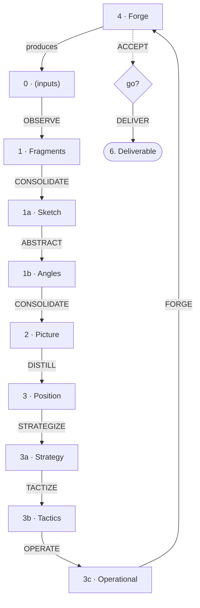

# Organon

*The instrument of thought.*

A method for projects where knowledge is critical and understanding must be refined before acting. Same cycle as Elasis and Anabasis, with both refinement modules: knowledge refinement (Sketch → Angles → enriched Picture) and production refinement (Strategy → Tactics → Operational).

Organon is the most complete profile of the Kyklos family. It invests in understanding before deciding, and in planning before materialising.

The name means "instrument" (ὄργανον).

---

## The Cycle

Every Kyklos method is a cycle. Organon adds two refinement modules to the common trunk: one that deepens knowledge (between Fragments and Picture), and one that deploys action (between Position and Forge).



| # | Level | Pole | Role |
|---|-------|------|------|
| 0 | *(parallel input folders)* | Experience | Raw input — lived, received, observed |
| 1 | Fragments | — | Observe, name, keep |
| 1a | Sketch | — | First consolidation — rough patterns |
| 1b | Angles | — | Orthogonal dimensions, spectrums, trade-offs |
| 2 | Picture | Knowledge | Enriched consolidation informed by Angles |
| 3 | Position | — | Frame for action (+ directives) |
| 3a | Strategy | — | Orientations for a specific objective |
| 3b | Tactics | — | Repeatable patterns, concrete moves |
| 3c | Operational | — | Tooling, deployment, production conditions |
| 4 | Forge | Experience | Materialise, act on the world |

Two poles: **Forge/inputs** (experience) and **Picture** (knowledge).
Two interfaces: **Fragments** (between experience and knowledge) and **Position** (between knowledge and action).
Two refinement modules: **Sketch → Angles** (knowledge) and **Strategy → Tactics → Operational** (production).
Two artifacts: **Knowledge Artifact** (output of Picture) and **Executable Artifact** (output of Forge).

The cycle: `4 → 0 → 1 → 1a → 1b → 2 → 3 → 3a → 3b → 3c → 4`

### Two Natures

| Phases | Nature | Metaphor |
|--------|--------|----------|
| 0 → 1 → 2 | Research — from experience to understanding | Genotype |
| 3 → 4 | Application — from decision to production | Phenotype |

Picture (2) is the pivot — the passage from comprehension to action.

---

## Project Structure

```
Project/
├── README.md
├── INTENTION.md
├── REQUESTS.md
├── 1. Workshop/
│   ├── 0. Communication/
│   ├── 0. References/
│   ├── 1. Fragments/
│   ├── 1a. Sketch/
│   ├── 1b. Angles/
│   ├── 2. Picture/
│   ├── 3. Position/
│   ├── 3a. Strategy/
│   ├── 3b. Tactics/
│   ├── 3c. Operational/
│   └── 4. Forge/
├── 6. Deliverable/
├── 7. Attic/
├── 8. Purgatory/
├── 9. The Void/
├── local/
└── µ. LOCAL/
```

Level 0 can have multiple parallel folders — create what you need. See CHOICES (Kyklos .. CHOICES) for the full catalogue.

Gestures are documented in `µ. LOCAL/` — see Praxis (Tekton .. Praxis .. PRAXIS) for the infrastructure conventions.

---

## The Levels

### Input Zone (0)

Raw material of different types, held in parallel folders all numbered 0. Results from previous forge cycles, external references, communications, dialogues, surveys — each in its own folder. Not every project needs all of them.

Level 0 is not a working phase. It is an inbox — what enters the cycle before any observation has been made.

### Fragments (1)

Observations named and kept. Specific, grounded, tied to context. A fragment says: "I noticed this, it matters, here's why."

A good fragment is a module with minimal coupling — an autonomous unit of reasoning. Graph-theoretic analogy: fragments are nodes, dependencies are edges. Good fragmentation minimises inter-fragment edges.

### Sketch (1a)

First consolidation — patterns identified from fragments before the angles are extracted. The Sketch is what the Picture would be without the refinement step. It is honest but rough — good enough to see the shape, not yet informed by orthogonal analysis.

The Sketch is intermediate. It exists to feed Angles. Once the Picture is consolidated (enriched by Angles), the Sketch has served its purpose.

### Angles (1b)

Dimensions that map the possible. Each angle defines a spectrum and its trade-offs — without choosing a position. Angles describe; Position prescribes.

An angle is orthogonal — it captures a dimension that other angles do not. Two angles that say the same thing in different words are one angle. The goal is a minimal set of independent dimensions that together cover the space of meaningful choices.

**Angle template:**

```
# [Name]

## Dimension

[pole A] ↔ [pole B]

## Characteristics

**[Pole A]**
- [salient characteristic]
- ...

**[Pole B]**
- [salient characteristic]
- ...
```

Each pole lists what makes it distinct. A characteristic appears where it is salient.

### Picture (2)

Patterns consolidated from fragments, enriched by Angles. In Organon, the Picture is the result of a double consolidation: first into Sketch (rough), then through Angles (orthogonal analysis), then into Picture (enriched).

The Picture does not choose. It maps. Choices belong to Position. But in Organon, the Picture maps with greater depth — the Angles have revealed dimensions that a single-pass consolidation would miss.

The Picture is a **Knowledge Artifact** — it can be shared, referenced, and used independently of the rest of the cycle. It is the knowledge pole of the cycle.

### Position (3)

Where choices are made. Given the patterns mapped by the Picture and the dimensions revealed by Angles, Position picks a stance — what we do, what we reject, what we accept as trade-off.

In Organon, the Position is informed by Angles. It takes an explicit stance on each relevant angle — choosing a pole or a position on the spectrum, and accepting the trade-off.

Position carries **context** — lateral forces that shape decisions without participating in them: choices, constraints, beliefs. These are implemented as directives (Genesis convention).

**Position template (when informed by Angles):**

```
# [Name]

## Source angles

- **[angle]** : we choose [pole] rather than [other pole] — [why]

## Motto

**"[short phrase]"**

## Position

[What we decide. Prescriptive.]

## Why

[What this position makes possible.]
```

A Position informed by Angles is a stance on one or more angles. It says what we choose — and accepts the trade-offs.

### Strategy (3a)

Translates Position into orientations for a specific objective. Still abstract, but aimed.

### Tactics (3b)

Habitual responses. Repeatable patterns that implement strategy without re-deciding each time.

### Operational (3c)

Organises production. Tooling choices, deployment conditions, format requirements.

### Forge (4)

Where intent becomes artefact. The Forge materialises — it acts on the world, produces the deliverable, generates results.

The Forge includes **UAT** — review against the previous deliverable before delivery. What is forged is tested before it replaces what exists.

The output is an **Executable Artifact** — something that works, that can be deployed, used, applied.

In Organon, the Forge takes its input from the full refinement chain: Position → Strategy → Tactics → Operational → Forge. The depth of understanding translates into precision of materialisation.

---

## Gestures

Organon defines twelve gestures. The seven trunk gestures are shared with all Kyklos profiles. Three belong to the production refinement module (shared with Anabasis). One belongs to the knowledge refinement module (unique to Organon).

Each follows the Praxis anatomy (Tekton .. Praxis .. PRAXIS). The gesture files live in `µ. LOCAL/GESTURES/`. The PLAYBOOK describes their sequencing.

### Trunk gestures (shared with Elasis and Anabasis)

| Gesture | Transition | Nature |
|---------|-----------|--------|
| OBSERVE | 0 → Fragments | Name an experience worth keeping |
| CONSOLIDATE | Fragments → Sketch, then Angles → Picture | Reveal patterns (executed twice) |
| DISTILL | Picture → Position | Frame for action |
| FORGE | Operational → Forge | Materialise |
| ACCEPT | Forge → go/no-go | Review against the previous deliverable |
| DELIVER | Forge → Deliverable | Install the new, keep the previous recoverable |
| HARVEST | (external) → Fragments | Import from another project |

### Knowledge refinement gesture

| Gesture | Transition | Nature |
|---------|-----------|--------|
| ABSTRACT | Sketch → Angles | Extract orthogonal dimensions |

### Production refinement gestures (shared with Anabasis)

| Gesture | Transition | Nature |
|---------|-----------|--------|
| STRATEGIZE | Position → Strategy | Plan how to achieve it |
| TACTIZE | Strategy → Tactics | Define recurring practices |
| OPERATE | Tactics → Operational | Organise production |

Each production gesture begins by prospecting what already exists at its level of abstraction — approaches, tools, infrastructure, or components — so that only the delta needs to be created.

Note: CONSOLIDATE is a single gesture executed twice in the knowledge refinement module — first to produce the Sketch (from Fragments), then to produce the enriched Picture (from Fragments + Angles). The inputs differ; the gesture is the same.

---

## Directives

At each level, **directives** can influence the work without participating in it. They are lateral forces — scope boundaries, constraints, preferences — that shape judgment without being the judgment.

Directives are UPPERCASE files inside the level's folder. They are typed on two axes — source and binding force:

| Directive | Source | Force | What it says |
|-----------|--------|-------|--------------|
| FRAME | — | Structural | "Here is the perimeter" |
| CONSTRAINTS | External | **Strong** | "You must respect this — imposed from outside" |
| CHOICES | Internal | **Strong** | "We decided this — it must be respected" |
| CONSIDERATIONS | External | **Medium** | "Here is the terrain — take it into account" |
| CONVICTIONS | Internal | **Medium** | "We believe this deeply — it influences but does not prescribe" |
| TEMPERED | Experience | **Strong** | "Practice has confirmed this" |

Directives survive regeneration. If the work at a level is rewritten, directives remain — they are the memory of what was learned along the way.

---

## Bridges

New knowledge can challenge existing directives at any level. In Organon, the knowledge refinement module creates particularly rich bridge opportunities: Angles may reveal that a Position directive was based on a false dichotomy, or that a Strategy rests on an assumption the Sketch contradicts.

The bridge mechanism is general: when any new insight (fragment, pattern, angle) contradicts a directive, the directive must be revisited. The cycle self-corrects by walking.

---

## Different Speeds

Not all levels move at the same rhythm:

| Level | Rhythm |
|-------|--------|
| Inputs / Forge | Constantly — every pass through the cycle |
| Fragments / Tactics | With observation — when something is noticed |
| Sketch / Strategy | When fragments accumulate enough to demand re-consolidation |
| Angles / Position | Rarely — but when they change, the impact propagates widely |
| Picture | When Angles reveal something new |

The deeper the level, the slower it moves — and the larger the impact when it does.

---

## Injection

The cycle is not a monologue. At each level, reviewing the output reveals things you didn't know you knew:

- Something jars → a fragment is missing, or a constraint was undocumented
- Something resonates → a deeper principle is at work, worth capturing

Capture it in directives (at the current level) or in fragments (upstream). Then regenerate. By iteration, the output converges toward what is right.

The process is not: specify then generate. It is: generate, review, inject, regenerate.

---

## Input Channels

A project needs visible entry points for feedback. **REQUESTS.md** receives suggestions, critiques, and demands from any operator at any level. It feeds the project without contaminating work in progress.

A request is a living item. Open items need attention. Resolved items are either elevated (into a fragment, a deliverable, a README, a CHANGELOG) or deleted. The request is not the memory — the artefact it produced is.

---

## Excluded Zones

Three zones with a retention gradient:

| # | Zone | Purpose | Contract |
|---|------|---------|----------|
| 7 | **Attic** | Archived/historical | Preserved for reference, not for active work |
| 8 | **Purgatory** | Superseded content | Consultable for rollback, cleanable periodically |
| 9 | **Void** | Discarded content | May be wiped without notification |

The contract applies to any operator — human or AI. No one should read, search, cite, or rely on content in excluded zones, but anyone can use them as destinations when moving content out of active areas.

---

## Fundamental Rules

1. **Coherence.** If a level is challenged — by observation, by a new angle, or by results — evaluate causes and implications, and adapt to maintain coherence of the whole.

2. **Position is not dogmatic.** It emerges from Angles, which emerge from Fragments, which emerge from experience. What the field invalidates must change.

3. **Start anywhere.** No need to start from the top — you can climb up from Fragments. Not every project needs all refinement levels immediately.

---

## Recommended Positions

These positions form a coherent set. They can be adopted, adapted, or extended. Each is a stance on one or more implicit angles.

### 1. Step by step

*Position, strategy, tactics, operations — step by step.*

Each level has its focus. Don't mix. Before descending, the upper level must be established.

### 2. The field is always right

*What doesn't survive contact with reality must change.*

Every decision is a hypothesis tested by results. Adjustment can go as high as needed — but first verify that lower levels were correctly executed.

### 3. Iterate to stay flexible

*Don't over-specify in advance.*

Iteration is the default mode. It guarantees the flexibility that enables adaptation. Validate by experience rather than specification.

### 4. Protect the critical, free the rest

*License to fail on the non-critical.*

On the critical: stability, control. On the rest: experiment, vary, fail to learn. This is a position of permission.

### 5. Abstract to reuse

*Abstraction is an investment.*

What is abstract travels between domains. What is decomposed can be recomposed. One method beats a thousand ad hoc solutions.

### 6. Proportion effort to scope

*The effort must match the impact.*

Before acting, make scope explicit: what changes, what it could break (upstream), what it implies (downstream). Local changes get local treatment. Systemic changes get systemic propagation.

### 7. Maintain layers

*Depth for thinking, surface for acting.*

For any significant topic, maintain multiple renderings: raw observations for yourself, honest analysis for peers, framed position for decision-makers. Each is true. Moving between them is translation, not dilution.

---

## How to Use

### Starting a Project

1. Create the folder structure (or deploy the template)
2. Write **INTENTION.md** at the root — why does this project exist?
3. Start with **Fragments/** — what do you observe? What matters?
4. When fragments accumulate, CONSOLIDATE into **Sketch/**
5. When the Sketch reveals dimensions worth exploring, ABSTRACT into **Angles/**
6. CONSOLIDATE again into **Picture/** — now enriched by Angles
7. DISTILL into **Position/** when the Picture is solid enough to act on
8. Deploy through **Strategy/** → **Tactics/** → **Operational/** as the project matures
9. FORGE when ready, then ACCEPT and DELIVER

### Maintaining a Project

- When reality changes, update from the bottom: Fragments first, then let changes propagate through the cycle.
- When Angles reveal new dimensions, re-consolidate the Picture before revising Position.
- When Position drifts from Picture, reconcile — don't let them diverge silently.
- Date your fragments. Your future self will thank you.
- Use directives to capture what you learn along the way — they are your lateral memory.

### Producing the Deliverable

FORGE generates the artefact in `4. Forge/`. ACCEPT compares it with the current version in `6. Deliverable/` — what changed, what was lost, what was gained. If satisfied, DELIVER installs the new one, making sure the previous state remains recoverable. Do not write directly in `6. Deliverable/` — forge first, accept, then deliver.

How recoverability is obtained is an Operational choice, not a method one — see the PLAYBOOK.

The deliverable also carries an **`ABOUT`** — what it is about, and when it serves. What leaves the workshop arrives bare: none of what surrounded it there crosses with it. Self-sufficiency stated negatively — nothing external required — is not enough; owing nothing to your workshop is not the same as being able to introduce yourself. FORGE writes it, ACCEPT reviews it.

### AI as Partner

Work at Fragments, Sketch, and Angles level with AI. It can hold complexity, challenge reasoning, extract dimensions, and help refine understanding — without political cost.

Once Picture is solid, DISTILL to Position for human audiences. The AI becomes a space where depth is safe.

### Feedback

If you apply this method, **feed back your learnings**:
- What **worked** — confirmations, reinforcements
- What **failed** — invalidations, corrections needed
- What's **missing** — angles not covered, situations not anticipated

This feedback feeds Kyklos. The field is always right.

---

## When to Use Organon

Use Organon when:
- Knowledge is critical and not yet well understood
- The domain has hidden dimensions worth exploring
- Understanding must be refined before action makes sense
- The project is a long-term investigation, not a sprint
- You need to map trade-offs before choosing a stance

When the knowledge is well understood and speed matters, consider Elasis (no refinement modules). When production needs structure but knowledge is already clear, consider Anabasis (production refinement only).

---

## Kyklos Family

Organon is the most complete profile of **Kyklos** (κύκλος) — the unified cycle of learning and production.

Three profiles share the same trunk and the same core gestures. They differ in how much refinement is applied between the trunk levels:

| Profile | Knowledge refinement | Production refinement |
|---------|--------------------|--------------------|
| **Elasis** | — | — |
| **Anabasis** | — | Strategy → Tactics → Operational |
| **Organon** | Sketch → Angles → enriched Picture | Strategy → Tactics → Operational |

All three are cycles. All three produce and learn. The question is: where does the project need more refinement?

See also: Elasis (Kyklos .. ELASIS), Anabasis (Kyklos .. ANABASIS).

---

## Dependencies

Organon depends on:
- **Genesis** (Tekton .. Genesis .. GENESIS) — workspace design conventions
- **Praxis** (Tekton .. Praxis .. PRAXIS) — gesture anatomy, µ namespace, orientation

---

*The breath continues.*
